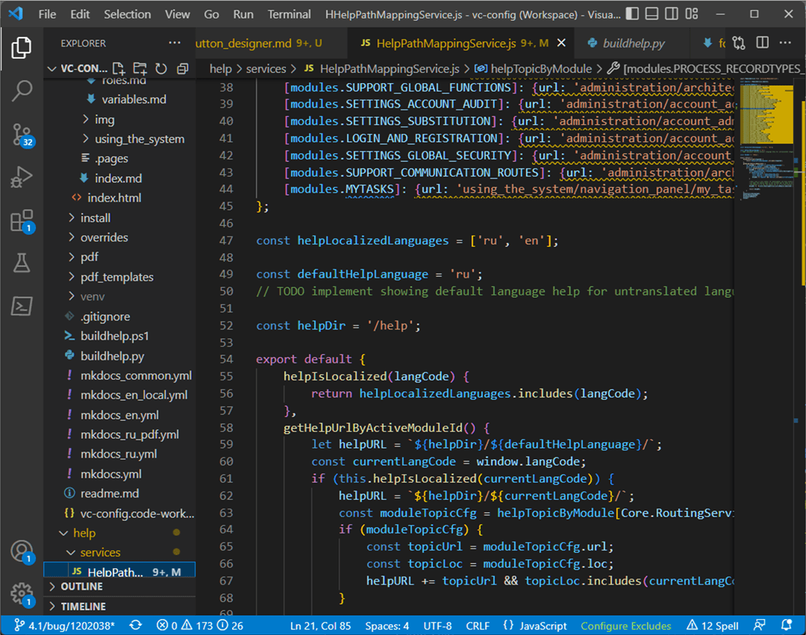

# Readme

This is a demo excerpt from the CMW Lab's low-code BPM platform help.

The excerpt is imported from MkDocs.

GitBook view link: [https://arterm-sedov.gitbook.io/help-sample/forms/](forms/)

GitHub repository: [https://github.com/arterm-sedov/gitbook-cmw-excerpt/](https://github.com/arterm-sedov/gitbook-cmw-excerpt/)

### Task

From the ground up, create a docs-as-code context- and locale-aware help system for a low-code business application platform (the CMW Platform). Integrate help authoring with the knowledge base, version control, and CI/CD workflows.

### Input

The company provided me with real-world business apps powered by the CMW Platform and platform source code to research.

### Process

1. I've explored the platform codebase to determine which documentation framework would be suitable and maintainable in the long term for our product. Candidates were: Antora, Sphinx, MkDocs, Jekyll, DITA + Oxygen, and Adobe RoboHelp.
2. After consulting with the product owner, developers, system analysts, and content creators, I suggested the finalists — docs-as-code frameworks that would fit all or most requirements including the potential for single source documentation — Antora and MkDocs.
3. We've opted for MkDocs paired with the well-supported Material for MkDocs theme for its simplicity, wide adoption, and expandability.
4. Among the requirements were context and locale awareness of the help system: when the user taps Help, they should see an article relevant to the platform screen they're viewing and in the current platform language. To implement this behavior, I've developed a JavaScript help context resolver that uses the platform's module and localization services to determine the path to the relevant help page in the user's language.
5. When the help framework was ready for authoring, I developed Python, npm (JavaScript), and shell scripts to integrate the MkDocs build steps into our product build pipeline for Windows and Linux.
6. The product has different branding for different markets, so the help content is brand-agnostic and parametrized (including brand names, CSS, fonts, icons, and colors). Branded items are configured in YML files.
7. The help system also inherits the CSS styles of the host platform, so the help site looks in line with the themes our customers develop for their apps powered by the CMW Platform.
8. We use VS Code and Git to author, review, and approve the help content.
9. I developed Python scripts to parse and import articles from the MkDocs help into the PHPKB-powered knowledge base.

### Result

60k+ words and 1k+ screenshots MkDocs help system integrated with the knowledge base, a help context resolver, and a cross-platform build agent that support multiple languages and adhere to the host platform context and theme.

<figure><figcaption>
Python help build script
</figcaption></figure>

<figure><figcaption>
Help context and language JavaScript resolver
</figcaption></figure>

<figure><figcaption>
Help article markdown source
</figcaption></figure>

<figure><figcaption>
Resulting MkDocs help article
</figcaption></figure>

Tap **Forms** below to view the imported MkDocs excerpts in GitBook.
