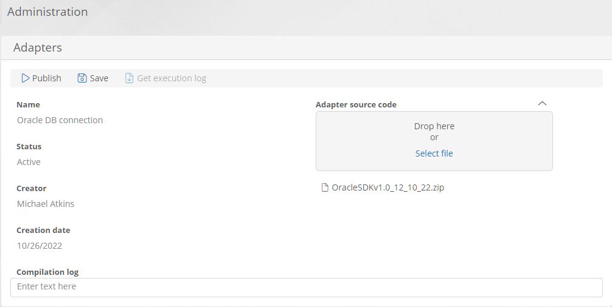
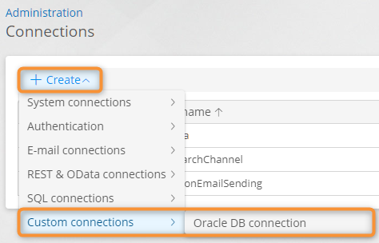

# Adapters


**Definition**

An adapter is a module (compiled as a DLL) that provides a custom connection with its communication route to integrate the **CMW Platform** with external systems.

Loaded modules are compiled on the server side, and corresponding connections become available when creating connections and communication routes. You can then use the adapter communication routes in your application to exchange data with external systems.


### Use the Adapter List

1. Select **Adapters** on the **Administration** — **Infrastructure** page.
2. The adapter list opens.
3. Perform the following operations:
   * **Select** — check a box in the first column to select an adapter.
   * **Open** — double-click an adapter row to [configure t](adapters.md#configure-an-adatpter)he existing adapter.
   * **Create** — [configure](adapters.md#configure-an-adatpter) a new adapter.
   *   **Delete** — select an adapter row and click **Delete.** Confirm the deletion.&#x20;

       
       Connections and communication routes generated for the deleted adapter will be deactivated and stop working.
       
   * **Search** — click this button and enter keywords in the **Search** field. The rows containing the keywords will be shown.

<figure><figcaption>
Adapter list
</figcaption></figure>

### Configure an Adatpter

1. Open the [adapter list](adapters.md#use-the-adapter-list).
2. Click **Create** or double-click an adapter in the list.
3.  The adapter properties page opens.

    <figure><figcaption>
Adapter properties page
</figcaption></figure>
4.  Upload a ZIP archive with the adapter source code in the **Adapter source code** field. \
    The archive must contain the Visual Studio solution:

    * Project with adapter source code.
    * Projects containing the interfaces for the development and subsequent compilation of the adapter.
    * Necessary additional projects for the adapter, for example, a localization project.
    * Folder with the connected libraries.
    * Single solution file (.sln) in the archive's root folder.

    <figure><figcaption>
Adapter source code archive contents example
</figcaption></figure>
5. Click **Save**.
6. Click **Publish** to compile the adapter.
7. Upon successful compilation, the adapter name appears in the adapter list and adapter properties.
8. An item for the compiled adapter appears in the **Create**→**Custom connections** menu on the **Connections** and **Communication routes** page.
9. After compilation, view the **compilation log**.
10. To [use the adapter](adapters.md#use-the-adapter), create a connection and communication routes for it.
11. If the adapter was used after publishing, download and view the [execution log](adapters.md#viewing-the-adapter-execution-log).

### View the Adapter Execution Log

After you publish the adapter and use its connection and communication routes, you can download the adaptor execution log from its properties pages.

1. Open the [adapter list](adapters.md#use-the-adapter-list).
2. Open an adapter by double-clicking it.
3. Click **Get execution log** to download the adapter execution log archive (for example, _CBAP.adapters.20221026.logs.zip_).
4.  Unpack and view the log.

    <figure><figcaption>
Adapter execution log example
</figcaption></figure>

### Use the Adapter

An item for the compiled adapter appears in the **Create**→**Custom connections** menu on the **Connections** and **Communication routes** page.

1. Create and configure a connection for your adapter.
2. Create and configure a communication route using your adapter connection.
3. Use the communication route in your application to communicate with external systems.

<figure><figcaption>
Creating a connection using a custom adapter
</figcaption></figure>

<figure><figcaption>
Creating a communication route using a custom adapter
</figcaption></figure>

### Delete an Adapter

1. Open the [adapter list](broken-reference).
2. Check the box in the first column for the adapter to be deleted.
3. Click **Delete**.
4. In the confirmation window, click **Delete**.
