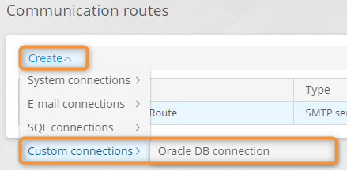

# Adapters


**Definition**

An adapter is a module (compiled as a DLL) that provides a custom connection with its communication route to integrate the **CMW Platform** with external systems.

Loaded modules are compiled on the server side, and corresponding connections become available when creating connections and communication routes. You can then use the adapter communication routes in your application to exchange data with external systems.


## Use the Adapter List

1. On the **Administration** page, select **Infrastructure** → **Adapters**.
2. The adapter list opens.
3. Perform the following operations:
   * **Open** — double-click an adapter row to [configure ](adapters.md#configure-an-adapter)the existing adapter.
   * **Create** — [configure](adapters.md#configure-an-adapter) a new adapter.
   * **Delete** — select a checkbox in the first column for an adapter and click **Delete.** Confirm the adapter deletion.


If you **delete an adapter**, connections and communication routes generated for the adapter will be deactivated and stop working.


<figure><figcaption>
Adapter list
</figcaption></figure>

## Configure an Adapter

1. Open the [adapter list](adapters.md#use-the-adapter-list).
2. Click **Create** or double-click an adapter in the list.
3.  The adapter properties page opens.

    <figure><figcaption>
Adapter properties page
</figcaption></figure>
4.  Upload a ZIP archive with the adapter source code in the **Adapter source code** field.\
    The archive must contain the Visual Studio solution:

    * Solution file (.sln) in the archive's root folder.
    * Project with the adapter source code.
    * Projects containing the interfaces for the development and compilation of the adapter.
    * Any additional projects needed for the adapter, e.g., a localization project.
    * Folder with the necessary libraries.

    <figure><figcaption>
Adapter source code archive contents example
</figcaption></figure>
5. **Save** the adapter.
6. **Publish** the adapter to compile it.
7. Upon successful compilation, the adapter name appears in the adapter list and on the adapter properties page.
8. An item for the compiled adapter appears in the **Create** — **Custom connections** menu on the **Connections** and **Communication routes** page.
9. After compilation, view the **compilation log**.
10. To [use the adapter](adapters.md#use-the-adapter), create a connection and communication routes for it.
11. If the adapter was used after publishing, download and view the [execution log](adapters.md#viewing-the-adapter-execution-log).

## View the Adapter Execution Log

After you publish the adapter and use its connection and communication routes, you can download the adaptor execution log from its properties pages.

1. Open the [adapter list](adapters.md#use-the-adapter-list).
2. Open an adapter by double-clicking it.
3. Click **Get execution log** to download the adapter execution log archive (for example, _CBAP.adapters.20221026.logs.zip_).
4.  Unpack and view the log.

    <figure><figcaption>
Adapter execution log example
</figcaption></figure>

## Use the Adapter

An item for the compiled adapter appears in the **Create** — **Custom connections** menu on the **Connections** and **Communication routes** page.

1. Create and configure a connection for your adapter.
2. Create and configure a communication route using your adapter connection.
3. Use the communication route in your application to communicate with external systems.

<figure><figcaption>
Creating a connection using a custom adapter
</figcaption></figure>

<figure><figcaption>
Creating a communication route using a custom adapter
</figcaption></figure>
