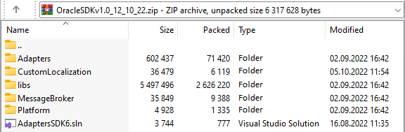
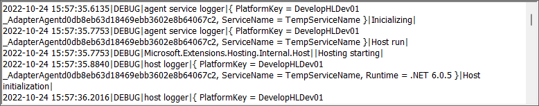

# Configuring an Adapter

1. Open the [adapter list](adapter-list-operations.md#viewing-the-adapter-list).
2. [Create](creating-an-adapter.md) or open an adapter by double-clicking it.
3.  The adapter properties page opens.

    <figure><figcaption>
Adapter properties page
</figcaption></figure>
4.  Upload a ZIP archive with the adapter source code in the **Adapter source code** field. The archive must contain the Visual Studio solution:

    * Project with adapter source code.
    * Projects containing the interfaces for the development and subsequent compilation of the adapter.
    * Necessary additional projects for the adapter, for example, a localization project.
    * Folder with the connected libraries.
    * Single solution file (.sln) in the archive's root folder.

    <figure><figcaption>
Adapter source code archive contents example
</figcaption></figure>
5. Click **Save**.
6. Click **Publish** to compile the adapter.
7. Upon successful compilation, the adapter name will be displayed in the adapter list and adapter properties.
8. After compilation, view the **compilation log**.

### Viewing the Adapter Execution Log

After you publish the adapter and use its connection and communication routes, you can download the adaptor execution log from its properties page.

1. Open the [adapter list](adapter-list-operations.md#viewing-the-adapter-list).
2. Open an adapter by double-clicking it.
3. Click **Get execution log** to download the adapter execution log archive (for example, _CBAP.adapters.20221026.logs.zip_).
4.  Unpack and view the log.

    <figure><figcaption>
Adapter execution log example
</figcaption></figure>

### Using the Adapter

An item for the compiled adapter appears in the **Custom connections** submenu when creating a connection or communication route.

1. Create and configure a connection for your adapter.
2. Create and configure a communication route using your adapter connection.
3. Use the communication route in your application to communicate with external systems.

<figure><figcaption>
Creating a connection using a custom adapter
</figcaption></figure>

<figure><figcaption>
Creating a communication route using a custom adapter
</figcaption></figure>

### Related Articles 

[**Viewing the Adapter List**](adapter-list-operations.md#viewing-the-adapter-list)

[**Creating an Adapter**](creating-an-adapter.md)
