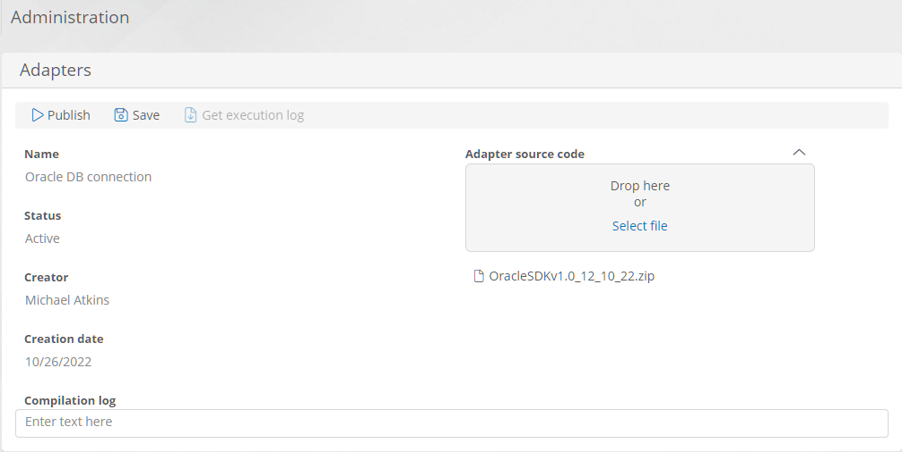
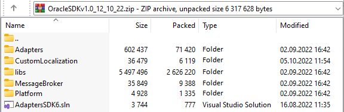
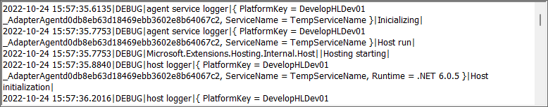
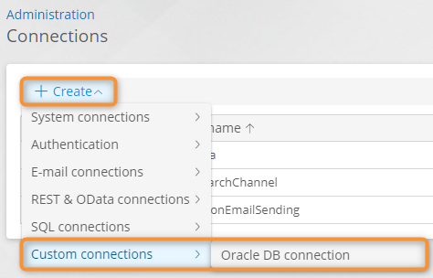
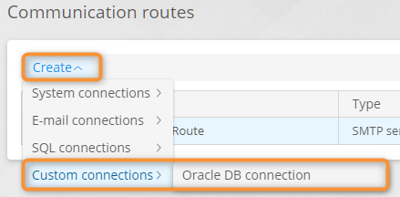

# Creating an Adapter

1. Open the [adapter list](viewing-the-adapter-list.md).
2. Click **Create**.
3.  The adapter properties page opens.

    <figure><figcaption>
Adapter properties page
</figcaption></figure>
4.  Upload a ZIP archive with the adapter source code in the **Adapter source code** field. The archive must contain the Visual Studio solution:

    * Project with adapter source code.
    * Projects containing the interfaces for the development and subsequent compilation of the adapter.
    * Necessary additional projects for the adapter, for example, a localization project.
    * Folder with the connected libraries.
    * Single solution file (.sln) in the archive's root folder.

    <figure><figcaption>
Adapter source code archive contents example
</figcaption></figure>
5. Click **Save**.
6. Click **Publish** to compile the adapter.
7. Upon successful compilation, the adapter name will be displayed in the adapter list and adapter properties.
8. After compilation, view the **compilation log**.
9.  To download the archive with adapter execution logs (for example, _CBAP.adapters.20221026.logs.zip_), click **Get execution log**.

    <figure><figcaption>
Adapter execution log example
</figcaption></figure>
10. The connection item for the compiled adapter will be displayed in the **Custom connections** submenu when creating a connection or communication route.

<figure><figcaption>
Creating a connection using a custom adapter
</figcaption></figure>

<figure><figcaption>
Creating a communication route using a custom adapter
</figcaption></figure>

### Related Articles 

[**Viewing the Adapter List**](viewing-the-adapter-list.md)
