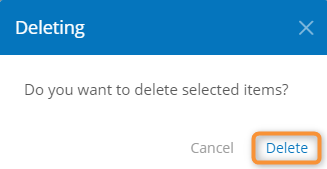

# Deleting an Adapter


Connections and communication routes generated for the deleted adapter will be deactivated and stop working.


1. Open the [adapter list](adapter-list-operations.md#viewing-the-adapter-list).
2. Check the box in the first column for the adapter to be deleted.
3. Click **Delete**.
4. In the confirmation window, click **Delete**.

<figure><figcaption>
Adapter delete confirmation
</figcaption></figure>

### Related Articles 

[**Viewing the Adapter List**](adapter-list-operations.md#viewing-the-adapter-list)
