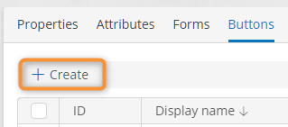

# Creating a Button

1. Open the template [button list](button-list-operations.md#viewing-the-template-button-list).
2. Click **Create**.
3. The button designer opens.
4. [Configure](button-designer.md) and save the button.

<figure><figcaption>
Creating a button from the button list
</figcaption></figure>

### Related Articles 

[**Viewing the Template Button List**](button-list-operations.md#viewing-the-template-button-list)

[**Configuring a Button**](button-designer.md)
