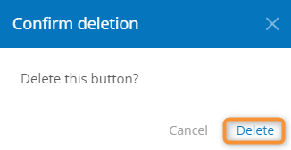

# Deleting a Button

1. Open the template [button list](broken-reference).
2. Check the checkbox in the first column for the button to be removed.
3.  Click **Delete**.

    1.

    <figure><figcaption>
Selecting a button to delete
</figcaption></figure>
4.  In the delete confirmation window, click **Delete**.

    <figure><figcaption>
Confirming button deletion
</figcaption></figure>

### Related Articles 

[**Viewing the Template Button List**](viewing-the-template-button-list.md)
