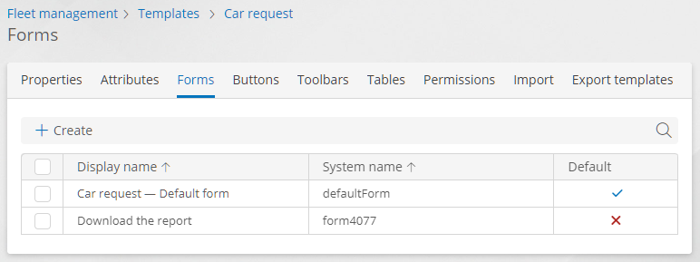
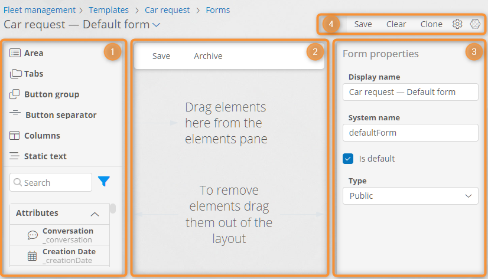
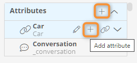
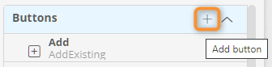
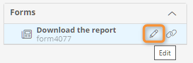
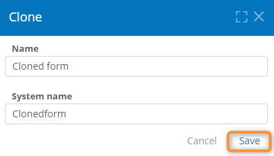
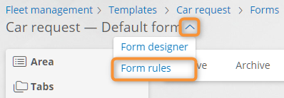

# Forms


**Definition**

A form is a web page designed to enter and display data. You can place fields (associated with attributes), static text, and visual elements on the form.


## Use the the Template's Form List

The list of forms is available for the record template, account template, role template, and organizational unit template.


**Note**

In the process template, the form list is not available, and the forms are created and configured using the process diagram element properties.


1. Open a record template, account template, role template, or organizational unit template.
2. Go to the **Forms** tab.
3. The list of forms in the template opens.
4. Perform the following operations:
   * **Select** — to choose a form, select a checkbox in the first column.
   * **Open** — double-click a form row to [configure ](forms.md#configure-the-form)the existing form.
   * **Create** — [configure ](forms.md#configure-the-form)a new form.
   * **Delete** — select a form and click **Delete**. Confirm the form deletion.
   * **Set as default** — select a form and click **Default** to display the form by default when opening template records.
   * **Search** — click  and enter keywords in the **Search** field. The rows containing the keywords will appear.

<figure><figcaption>
Template form list
</figcaption></figure>

## Configure the Form

Use the form designer to configure its layout, properties, and elements.

1. Open the template's [form list](forms.md#viewing-the-template-form-list).
2. Click **Create** or double-click a form in the list.
3.  The form designer appears with the following items:\
    \
    **(1) Elements pane** — drag the elements from the pane to the form: attributes, buttons, embedded forms, and visual elements. You can also edit and create elements [using the elements pane](forms.md#creating-an-attribute).\
    **(2) Form layout** — sets the form appearance.\
    **(3) Properties pane** — view and configure the selected element properties.\
    **(4) Buttons:**

    * **Save** — save the form.
    * **Clear** — remove all elements from the form layout.
    * **Clone** — create a form duplicate.
    * **Configure template**  — go to the template **Properties** page.
    * **Relations**  — view a list of application objects that use the form.

    <figure><figcaption></figcaption></figure>
4. To set the form properties, click an empty layout area and configure the properties using the properties pane:
   * **Display name** — a title that appears in the form heading when viewing template records.
   * **System name** — a unique name used to identify the form in scripts, expressions, and scenarios.
   * **Is default** — select this checkbox to display the form by default when opening template records.
   * **Type**:
     * **Public** — select this type to make the form accessible for viewing from the form selection dropdown next to the form title.
     * **Internal** — select this type to make the form visible only if it is embedded in another form, set as a record form, or opened via a direct URL (e.g., for process start, record creation, or dialogues).
5. Use the elements pane to:
   * Drag the [elements](forms.md#form-elements) from the elements pane to the form layout.
   * Click  to search for elements.
   * Click  to filter the element list by element type.
   * [Create](forms.md#creating-an-attribute) or [edit](forms.md#editing-an-attribute-button-or-form) attributes, buttons, and forms.
6. To set a form element properties, select it in the layout and configure the properties in the properties pane.
7. **Save** the form.
8. If needed, [configure the form rules](forms.md#editing-the-form).

### Form Elements 

You can place the following elements on the form from the [elements pane](forms.md#configure-the-form):

* **Area** — contains all other form elements. Place any elements in an area. The form must have at least one area. There can be several areas on a form.
* **Tabs** — arrange form elements on several tabs.
* **Columns** — arrange elements in several columns.
* **Static text** — displays arbitrary text with HTML formatting.
* **Attribute field** — drag an attribute to the form layout to create a field associated with the attribute. Field properties correspond to the associated attribute type.
* **Embedded form** — drag another form to the form layout to embed it into the current form.
* **Button group** — combines buttons into a dropdown.
* **Button separator** — visually separates buttons within button areas.


A **button area** is provided for each form and area. Place any **buttons**, **button groups**, or **button separators** in the button areas and not anywhere else on the form.


### Configure an Attribute, Button, or Embedded Form using the Elements Pane 

#### Create an Attribute 

1. In the elements pane:
   * To create an attribute in the current template, hover over the **Attributes** heading, or…
   * To create an attribute in the corresponding template, hover over the template name in the element list.
2. Click the **Add Attribute** button that appears.
3. The attribute properties window appears.
4. Configure and save the attribute.

<figure><figcaption>
Creating an attribute using the elements pane
</figcaption></figure>

#### Create a Button 

1. In the elements pane, hover over the **Buttons** heading.
2. Click the **Add button** button that appears.
3. The [button designer](buttons.md#opening-the-button-designer) appears.
4. Configure and save the button.

<figure><figcaption>
Creating a button using the elements pane
</figcaption></figure>

#### Edit an Attribute, Button, or Embedded Form 

1. Hover the mouse pointer over an attribute, button, or form name in the elements pane.
2. Click the **Edit attribute**, **Edit button**, or **Edit form** button that appears.
3. The attribute properties window, button designer, or form designer appears.
4. Configure and save the element.

<figure><figcaption>
Editing an embedded form using the elements pane
</figcaption></figure>

## Clone the Form 

1. In the form designer, click **Clone**.
2. In the form cloning window, enter the form **name** and **system name**.
3. **Save** the cloned form.
4. The new form opens in the form designer.

<figure><figcaption>
Form cloning
</figcaption></figure>

## Configure the Form Rules 

1. In the form designer, click the selector button next to the form title.
2. Select **Form rules** from the dropdown.
3. The form rule designer opens.
4. Edit the form rules.
5. **Save** the form rules.

<figure><figcaption>
Going to the form rules designer
</figcaption></figure>
