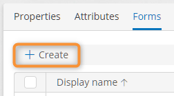

# Creating a Form

1. Open the template [form list](viewing-the-template-form-list.md).
2. Click **Create**.
3. The [form designer](form-designer.md) opens.
4. Configure and save the form.

<figure><figcaption>
Create button in the form list
</figcaption></figure>

### Related Articles 

[**Viewing the Template Form List**](viewing-the-template-form-list.md)

[**Configuring a Form**](form-designer.md)

