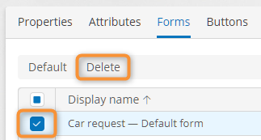
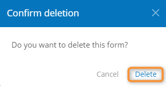

# Deleting a Form

1. Open the template [form list](viewing-the-template-form-list.md).
2. Check the box in the first column for the form to be deleted.
3.  Click **Delete**.

    <figure><figcaption>
Selecting the form to delete
</figcaption></figure>
4.  In the delete confirmation window, click **Delete**.

    <figure><figcaption>
Confirming form deletion
</figcaption></figure>

### Related Articles 

[**Viewing the Template Form List**](broken-reference)

